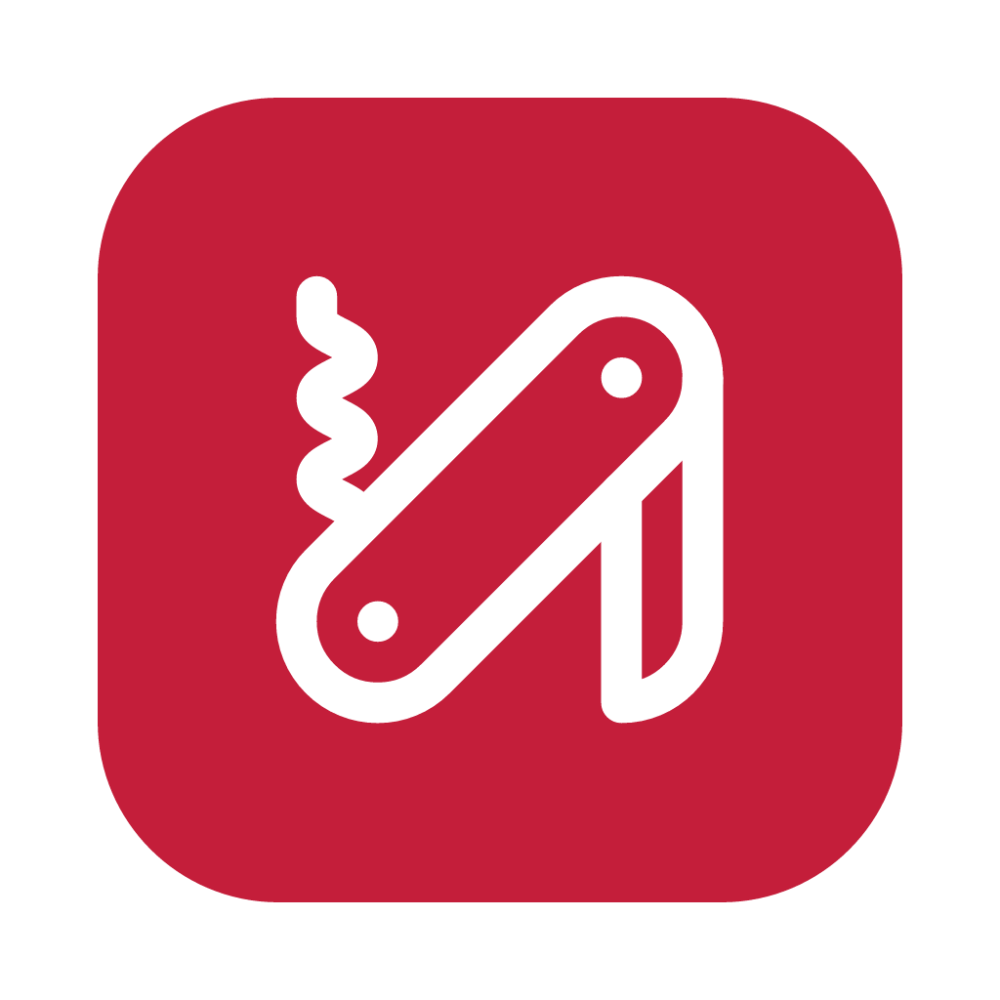

<p align="center">
  
</p>

<h1 align="center">swiss</h1>

<p align="center">Desktop app for downloading videos and converting media files.<br>Built with Electron, React, and TypeScript.</p>
<br>
Uses <a href="https://github.com/yt-dlp/yt-dlp">yt-dlp</a> for downloading from 1000+ sites and <a href="https://github.com/FFmpeg/FFmpeg">ffmpeg</a> for format conversion. Both binaries are managed automatically — installed on first launch if not already present.

## Features

- **Downloader** — Paste a URL, pick format (mp4, mkv, webm, mp3, wav, flac, aac) and quality, download. Supports all sites yt-dlp supports (YouTube, Twitter/X, Instagram, TikTok, etc). Cookie-based auth for private/age-restricted content.
- **Converter** — Drag & drop files, choose output format (mp4, mkv, avi, webm, mov, mp3, wav, flac, aac, wma), convert. Batch processing supported.
- **Settings** — Download path, cookie browser selection, binary management (install/update/uninstall yt-dlp and ffmpeg), auto-updates.

## Tech Stack

| Layer     | Tech                                            |
| --------- | ----------------------------------------------- |
| Shell     | Electron 30                                     |
| UI        | React 18, TypeScript, Tailwind CSS 4, shadcn/ui |
| Routing   | TanStack Router (file-based)                    |
| State     | Zustand (persisted to localStorage)             |
| Build     | Vite + vite-plugin-electron                     |
| Packaging | electron-builder (dmg/nsis/AppImage)            |
| Updates   | electron-updater (GitHub Releases)              |

## Installation

Download the latest release from [GitHub Releases](https://github.com/pedrosegato/swiss/releases).

### macOS

The app is not code-signed. macOS will block it on first open. To fix:

```bash
xattr -cr /Applications/Swiss.app
```
